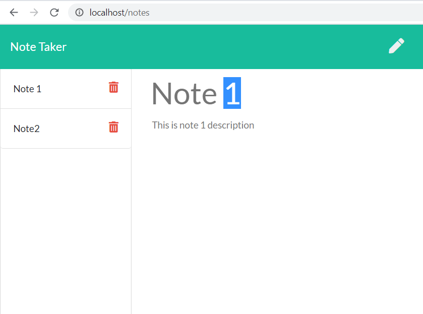

# NoteTaker

NoteTaker: Saving notes to JSON File with Node.js. This is an application that can be used to write, save, and delete notes. This application will use an express backend and save and retrieve note data from a JSON file.

## User Story

AS A user, I want to be able to write and save notes

I WANT to be able to delete notes I've written before

SO THAT I can organize my thoughts and keep track of tasks I need to complete

## Business Context

For users that need to keep track of a lot of information, it's easy to forget or be unable to recall something important. Being able to take persistent notes allows users to have written information available when needed.

## Application links
-  Github
> https://github.com/JameskuttySebastian/NoteTaker

-  Heroku
> https://notetaker-exp.herokuapp.com/

## Application Pages
 
This application has following features
*  Create and save notes
*  View previously saved notes.
*  Delete previously saved notes.

